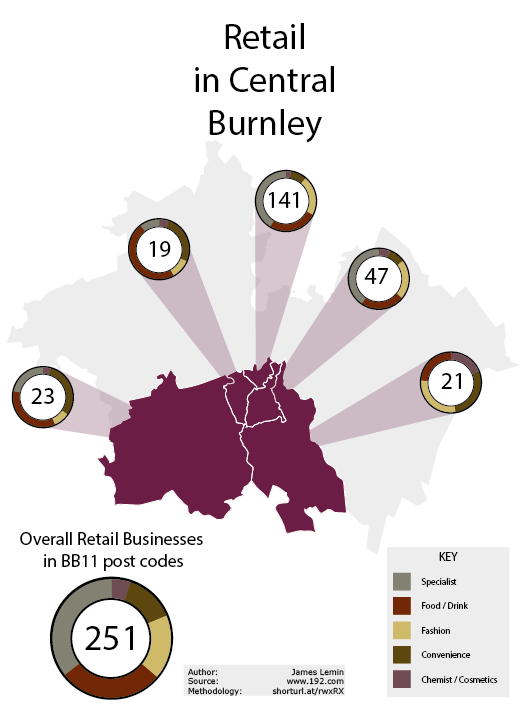

# Burnley Retail Analysis based on 192.com listings

shortURL: shorturl.at/rwxRX

## Description
This is a small repository demonstrating simple web scraping, and transforming the results into an image.

## Rationale
It is difficult to get accurate, granular information about what types of business operate ina  given area from central bodies (Office for national Statistics, Local councils and so on).
Free web directories such as Google Business offer much more granular information.

## Method
192.com was chosen given the simple, clean way it returns results.  192.com implicitly prevents automated webscraping by hiding specific results behind a generic url.  whilst this could be automated around (e.g. write a script that submits a query, then scrapes the result), a faster way of achieving this result was to manually query the site, and save the relevant html pages.

The [notebook](Business-Sector from 192 listings.ipynb) then loops over these saved html files, and scrapes compiles a csv based on their contents.  Duplicates are removed at this point, as are business types ("headquarters") which do not match our needs.

The resulting csv was manually queried to categorise businesses into one of the following five categories:

+ Specialist
+ food/drink
+ convenience
+ fashion, and
+ chemists/cosmetics shops.

The results were then aggregated by business type versus the first five characters of the postcode which was then plotted on a map of Burnley.

The manual aggregation was done in Excel, which were then rendered as pie charts.  Excel was also used to generate a postcode boundary map.
vectors were exported into [Illustrator](Retail in Central Burnley.ai) where they were manipulated to match theme guidelines.

## Issues
+ Manual scraping and manual manipulation means results are more subjective than ideal
+ Workflow is unnecessarily manual/prone to manual mistakes
+ script/notebook cannot easily be adapted to other uses

